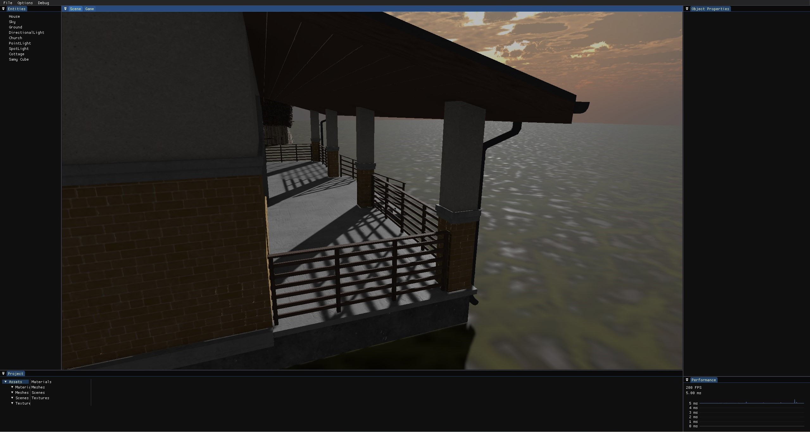
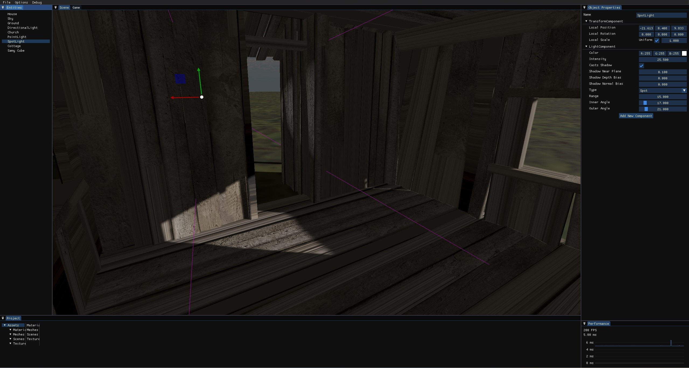
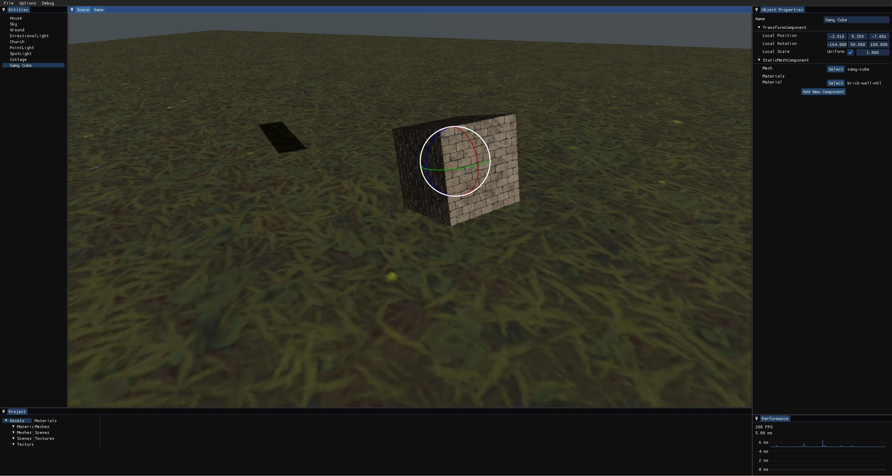
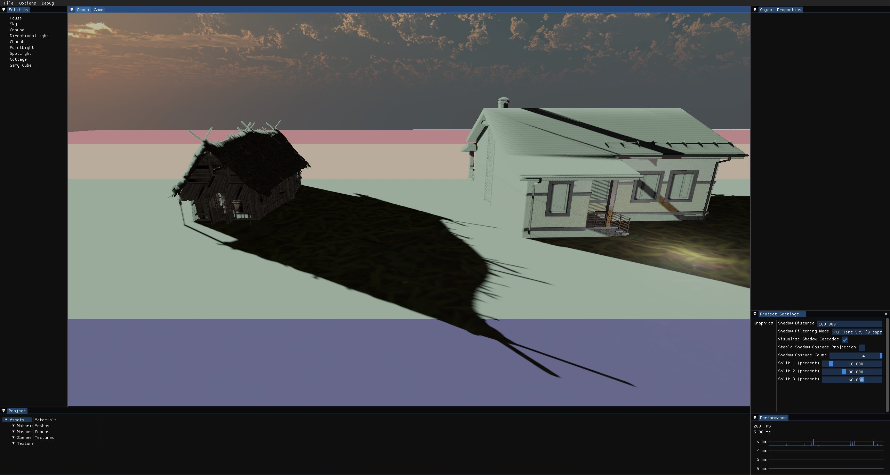

# 🪄 Sorcery 🪄

Sorcery is my homemade game engine that I started developing during my second BSc year as a way to learn about the technologies behind video games. I have used it as my BSc thesis and planning to use it as my MSc thesis too. Generally it lacks quite a few features, mainly because I can work on it only in my free time and I also keep reworking systems forever and ever as I learn new things. Basically I use it to implement, integrate, and play with ideas I come across as well my own.

## Features
Sorcery's renderer is built on DX11 and uses a built-in forward PBR pipeline with cascaded shadow maps for directional lights, classic shadow maps for spotlights and pointlights, all in atlases, using PCF filtering, normal mapping and skyboxes. There's a scripting layer using C++ that currently implements a Unity-like object-component system. Sorcery's editor, Mage, is a full-fledged tool with world editing, project management, asset importing, and much more.

## History and Direction
Sorcery has gone through many iterations over the years. Originally it was called LeopphEngine (pronounced "lœff", from my last name) and was only a simple C++ library running on top of OpenGL that you could link against and use kinda like you would a three.js, just in C++. The current direction is to make it a minimum viable but complete game engine.

## Used technologies and third-party libraries
Non-exhaustive list of core components:
- Win32 for window and event handling
- Direct3D 11 for rendering
- RTTR for runtime reflection
- Dear ImGui for tool interfaces
- Assimp for model asset importing

## Building and Usage
### Build requirements
- Windows SDK 10.0.14393.795 or newer
- MSBuild
- MSVC v143 toolset
### Runtime requirements
- Windows 10, version 1607 or newer, 64-bit
- Feature level 11_0 capable GPU
### Building
- Run **setup.bat** from the root directory
- Build the solution in the root directory
### Usage
Just open Mage and poke around in it!
